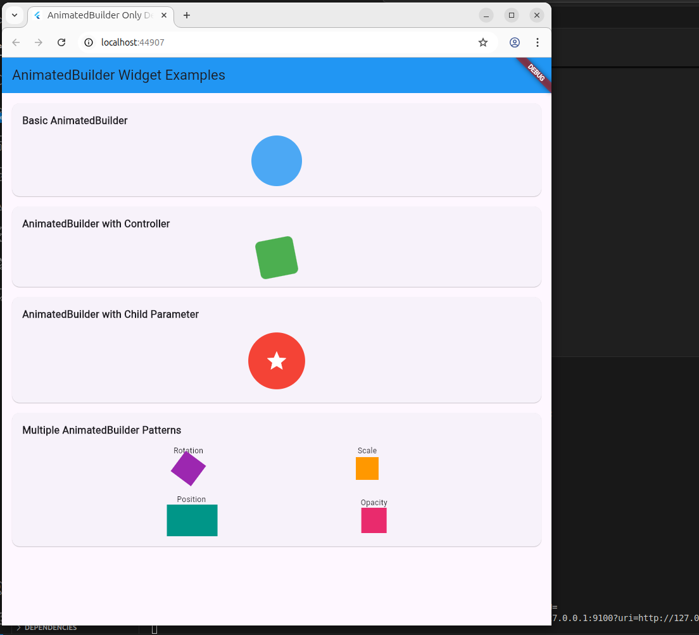

# AnimatedBuilder Widget Showcase

## What is `AnimatedBuilder`?

`AnimatedBuilder` is a powerful widget in Flutter used to rebuild only parts of the widget tree that need to be animated, thus improving performance. It listens to an animation and rebuilds its child widget whenever the animation updates.

Here's a simple example of how `AnimatedBuilder` works:

```dart
AnimatedBuilder(
  animation: animationController,
  builder: (context, child) {
    return Transform.rotate(
      angle: animationController.value * 2 * pi,
      child: child,
    );
  },
  child: Icon(Icons.refresh, size: 50),
)
```

In this example:
- `animationController` drives the rotation.
- `builder` function rebuilds with every tick.
- `child` is not rebuilt, which saves performance.

---

## About This App

This Flutter demo app showcases **four different use cases** of the `AnimatedBuilder` widget:

1. **Basic AnimatedBuilder** – Fades a circle in and out.
2. **AnimatedBuilder with Controller** – Rotates a square using a controller.
3. **AnimatedBuilder with Child Parameter** – Scales a widget efficiently using the `child` parameter.
4. **Multiple AnimatedBuilder Patterns** – Demonstrates rotation, scale, position, and opacity animations using separate controllers.

Each example is wrapped in a card and labeled for clarity.

---

## How to Run

1. Clone this repo:
   ```bash
   git clone < https://github.com/Uchantal/Animation_app.git>
   cd <project-folder>
   ```
2. Get dependencies:
   ```bash
   flutter pub get
   ```
3. Run the app:
   ```bash
   flutter run
   ```

---

## Attributes Demonstrated

- **animation**: Drives the widget’s changes.
- **builder**: Rebuilds the part of the widget tree affected by the animation.
- **child**: Prevents unnecessary rebuilds by keeping a static widget subtree.

---

## Screenshot



---


Feel free to explore and modify the animations for a better grasp of how `AnimatedBuilder` enhances performance and UI dynamics.
